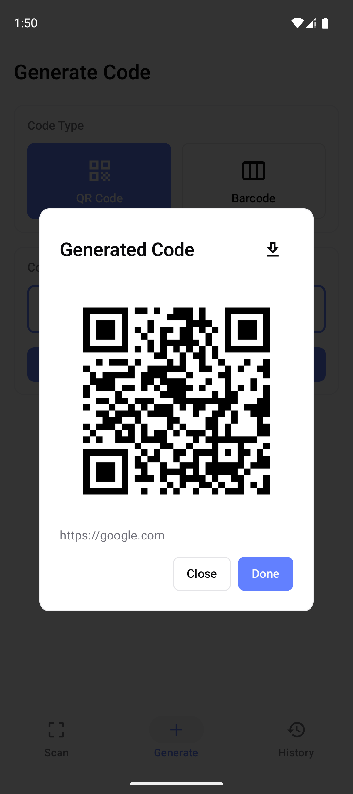

<p align="center">
  
</p>

<div align="center">
  <h1 align="center" >
    FastCodeScan
  </h1>
</div>

A fast, modern Android app for scanning and generating QR codes and barcodes.

## Snapshots

<div style="display: flex; gap: 20px"> 
    
    
</div>

## Features

### Scanning
- Real-time QR code and barcode scanning using device camera
- Support for multiple formats: QR Code, Code 128, Code 39, Code 93, CODABAR, EAN-13, EAN-8, ITF, UPC-A, UPC-E, Data Matrix, PDF 417, AZTEC
- Auto-detect and open URLs
- Copy scanned content to clipboard

### Generation
- Generate QR codes from text, URLs, or any content
- Generate barcodes in various formats (Code 128, Code 39, EAN-13, EAN-8, UPC-A, ITF)
- Save generated codes to device gallery
- Real-time preview

### History
- Persistent storage of all scan and generation records
- Separate tabs for scanned and generated history
- View, copy, or delete past records

## Tech Stack

- **Language:** Kotlin
- **UI:** Jetpack Compose with Material 3
- **Architecture:** Clean Architecture + MVVM
- **Camera:** CameraX
- **Scanning:** Google ML Kit Barcode Scanning
- **Generation:** ZXing
- **Database:** Room
- **DI:** Hilt
- **Async:** Kotlin Coroutines & Flow

## Requirements

- Android 8.0 (API 26) or higher
- Camera permission

## Build

```bash
./gradlew assembleDebug
```

## Project Structure

```
app/src/main/java/com/wongyichen/fastcodescan/
├── presentation/     # UI layer (Screens & ViewModels)
├── domain/           # Business logic (Models, Repository interfaces, UseCases)
├── data/             # Data layer (Room database, Repository implementation)
├── scanner/          # Scanning & generation logic
├── di/               # Hilt dependency injection modules
└── ui/               # Shared UI components & theme
```

## License

MIT License
